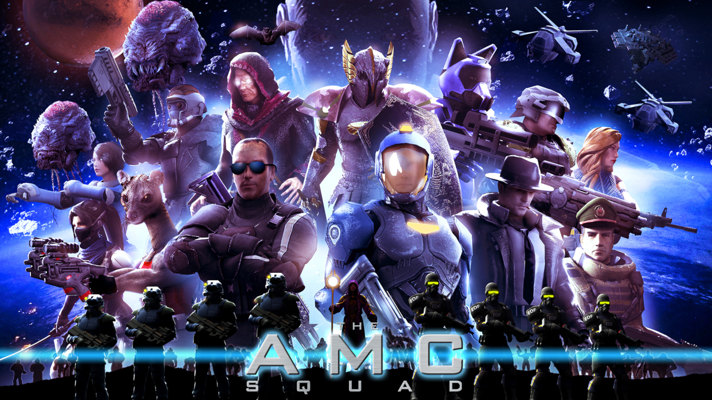

# README
My Portfolio is created using the **WhatATheme** Jekyll Portfolio theme as a starting point.
I then added new features and changes to make it work for my own game development portfolio.

---

### Content Credits :green_heart:
* [Font Awesome](https://fontawesome.com/)
* [Poppins Font](https://fonts.google.com/specimen/Poppins)

---

### WhatATheme Credits :bulb:
* [Sneha Omer](http://sassyecoder.github.io/)
* [Harsh Trivedi](http://harsh98trivedi.github.io/)

### License
The contents of this repository are licensed under the [**GNU General Public License v2.0**](https://github.com/thedevslot/WhatATheme/blob/master/LICENSE)
